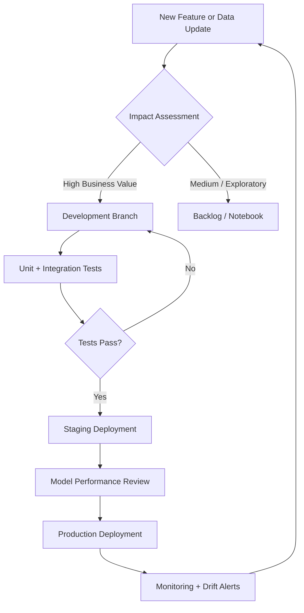

# ChurnShield AI

**Advanced Customer Churn Prediction and Retention Intelligence Platform**

ChurnShield AI is a production-grade machine learning system designed to identify customers at risk of churn, quantify business impact, and surface actionable retention strategies. The platform combines a multi-model ensemble with an interactive executive dashboard, enabling data-driven decisions grounded in model transparency and explainability.

---

## Table of Contents

- [Architecture Overview](#architecture-overview)
- [Key Capabilities](#key-capabilities)
- [Model Performance](#model-performance)
- [Dataset and Feature Engineering](#dataset-and-feature-engineering)
- [Tech Stack](#tech-stack)
- [Project Structure](#project-structure)
- [Installation](#installation)
- [Usage](#usage)
- [Dashboard Modules](#dashboard-modules)
- [Development Workflow](#development-workflow)
- [Contact](#contact)

---

## Architecture Overview

```
Raw Customer Data
        |
        v
Feature Engineering Pipeline
        |
        v
Multi-Model Ensemble (XGBoost + Random Forest + Logistic Regression)
        |
        v
SHAP Explainability Layer
        |
        v
Risk Scoring Engine --> Executive Dashboard --> Retention Action Triggers
```

ChurnShield separates concerns across four layers:

1. **Data Layer** — enriched telco dataset with derived behavioral, financial, and service-quality features
2. **Model Layer** — independently trained classifiers with calibrated probability outputs
3. **Explainability Layer** — per-prediction SHAP values surfaced to non-technical stakeholders
4. **Application Layer** — Streamlit dashboard with real-time scoring, segmentation, and ROI tooling

---

## Key Capabilities

### Prediction Engine

- Multi-model ensemble using XGBoost, Random Forest, and Logistic Regression
- SHAP (SHapley Additive exPlanations) for per-customer risk attribution
- Real-time churn probability scoring at inference time
- Calibrated confidence intervals on predictions

### Executive Intelligence Dashboard

- Customer segmentation by risk tier (low / medium / high / critical)
- Customer lifetime value (CLV) preservation estimates per segment
- Retention ROI calculator with adjustable campaign cost assumptions
- Churn trend analysis with rolling 3-month visibility

### Retention Toolkit

- Personalized intervention recommendations ranked by expected impact
- Pre-built email and SMS campaign templates triggered by risk tier
- Win-back incentive simulator for at-risk cohorts
- Feedback loop integration for closed-loop model improvement

### Continuous Learning

- Model auto-refresh pipeline compatible with new labeled data
- Performance monitoring with drift detection alerts
- Versioned model registry for rollback and A/B evaluation

---

## Model Performance

| Model               | Accuracy | Precision | Recall | AUC-ROC |
|---------------------|----------|-----------|--------|---------|
| Logistic Regression | 91.7%    | 80.2%     | 85.3%  | 0.91    |
| XGBoost             | 85.5%    | 83.0%     | 88.0%  | 0.85    |
| Random Forest       | 81.1%    | 82.3%     | 89.9%  | 0.81    |

**Notes:**
- Logistic Regression achieves the highest AUC and accuracy; preferred for interpretable deployments
- XGBoost balances precision and recall; recommended for cost-sensitive campaigns
- Random Forest leads on recall; use when minimizing missed churners is the priority
- All models trained with `imbalanced-learn` SMOTE oversampling to handle class imbalance
- Evaluation on held-out 20% test split; no data leakage between feature engineering and split

---

## Dataset and Feature Engineering

The base dataset is the IBM Telco Customer Churn dataset, enriched with the following derived features:

### Engineered Features

```python
# Ratio of tenure to monthly spend — captures loyalty relative to cost
df['TenureToChargeRatio'] = df['tenure'] / (df['MonthlyCharges'] + 1e-6)

# Value efficiency score — how total charges scale with tenure and monthly rate
df['TotalValueScore'] = (df['tenure'] * df['MonthlyCharges']) / df['TotalCharges']

# Service adoption density normalized by tenure length
df['ServiceDensity'] = df[['OnlineSecurity_Yes', 'OnlineBackup_Yes',
                            'DeviceProtection_Yes', 'TechSupport_Yes']].sum(axis=1) / df['tenure']

# Compound payment risk flag: electronic check + month-to-month contract
df['PaymentRisk'] = (
    df['PaymentMethod_Electronic check'].astype(int) *
    df['Contract_Month-to-month'].astype(int)
)

# High-cost, long-tenure segment — often overlooked retention target
df['HighCostLongTenure'] = (
    (df['MonthlyCharges'] > df['MonthlyCharges'].quantile(0.75)) &
    (df['tenure'] > df['tenure'].median())
).astype(int)
```

### Additional Enrichment

- **Customer Lifetime Value (CLV)** — estimated from tenure, monthly charges, and contract type
- **Service Usage Trends** — 3-month rolling averages for usage signals
- **Sentiment Scores** — derived from support ticket text via NLP preprocessing
- **Network Quality Metrics** — downtime and service degradation indicators

---

## Tech Stack

| Layer              | Technology                          | Version  |
|--------------------|-------------------------------------|----------|
| ML Core            | Python                              | 3.10     |
| Gradient Boosting  | XGBoost                             | 1.7      |
| Classical ML       | Scikit-learn                        | 1.2      |
| Class Imbalance    | Imbalanced-learn                    | 0.10     |
| Explainability     | SHAP                                | 0.41+    |
| Dashboard          | Streamlit                           | 1.22     |
| Visualization      | Plotly                              | 5.13     |
| Data Processing    | Pandas, NumPy                       | Latest   |

---

## Project Structure

```
ChurnShield_AI/
├── app.py                        # Streamlit entry point
├── requirements.txt
├── README.md
│
├── data/
│   ├── raw/                      # Original Telco dataset
│   ├── processed/                # Engineered feature set
│   └── enriched/                 # CLV, sentiment, network metrics
│
├── notebooks/
│   ├── 01_eda.ipynb              # Exploratory data analysis
│   ├── 02_feature_engineering.ipynb
│   └── 03_model_training.ipynb
│
├── models/
│   ├── xgboost_model.pkl
│   ├── rf_model.pkl
│   ├── lr_model.pkl
│   └── ensemble_weights.json
│
├── src/
│   ├── preprocessing.py          # Feature pipeline
│   ├── train.py                  # Model training scripts
│   ├── predict.py                # Inference and scoring
│   ├── explainability.py         # SHAP integration
│   └── retention.py              # Intervention recommendation logic
│
├── dashboard/
│   ├── pages/
│   │   ├── overview.py           # Executive summary
│   │   ├── customer_detail.py    # Per-customer drill-down
│   │   ├── segmentation.py       # Risk cohort analysis
│   │   └── roi_calculator.py     # Retention ROI tooling
│   └── components/               # Reusable Plotly chart components
│
└── tests/
    ├── test_preprocessing.py
    ├── test_model.py
    └── test_api.py
```

---

## Installation

### Prerequisites

- Python 3.10+
- pip or conda

### Setup

```bash
# Clone the repository
git clone https://github.com/codewithshami/ChurnShield_AI.git
cd ChurnShield_AI

# Create and activate a virtual environment
python -m venv venv
source venv/bin/activate        # Windows: venv\Scripts\activate

# Install dependencies
pip install -r requirements.txt
```

### Launch Dashboard

```bash
streamlit run app.py
```

Dashboard available at: `http://localhost:8501`

---

## Usage

### Batch Prediction

```python
from src.predict import ChurnPredictor

predictor = ChurnPredictor(model="xgboost")  # or "logistic", "random_forest"
predictions = predictor.predict(df_customers)

# Returns DataFrame with columns:
# customer_id | churn_probability | risk_tier | top_shap_factors | recommended_action
```

### Single Customer Scoring

```python
result = predictor.score_customer(customer_id="CUST_00123")
print(result["churn_probability"])    # e.g. 0.83
print(result["risk_tier"])            # e.g. "high"
print(result["top_factors"])          # e.g. ["Month-to-month contract", "Electronic check payment"]
```

### Retrain Pipeline

```bash
python src/train.py --data data/processed/latest.csv --models all --output models/
```

---

## Dashboard Modules

| Module              | Description                                                              |
|---------------------|--------------------------------------------------------------------------|
| Executive Overview  | Aggregate churn rate, at-risk revenue, CLV at stake, and trend charts    |
| Customer Segmentation | Risk tier breakdown with cohort-level statistics and filter controls   |
| Customer Detail     | Per-customer SHAP waterfall, history, and intervention recommendation    |
| Churn Trend Analysis | 3-month rolling churn signals by segment, contract type, and geography |
| Retention ROI Calculator | Campaign cost vs. expected retention value with sensitivity sliders |
| Win-back Simulator  | Model projected recovery rate given incentive type and timing            |

---

## Development Workflow



---

## Contact

**Lead Developer:** Mohd Shami

- LinkedIn: [linkedin.com/in/codexshami](https://www.linkedin.com/in/codexshami)
- Email: [codexshami@gmail.com](mailto:codexshami@gmail.com)
- GitHub Discussions: [ChurnShield AI Community](https://github.com/codewithshami/ChurnShield_AI/discussions)

---

*ChurnShield AI — Predict churn before it happens. Retain customers with precision.*

